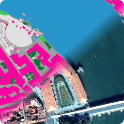

<div align="center">
  <a href="https://gitlab.cnes.fr/pluto/slum"></a>

<h4>slum</h4>

[](https://www.python.org/downloads/release/python-360/)


<p>
  <a href="#overview">Overview</a> •
  <a href="#features">Features</a> •
  <a href="#install">Install</a> •
  <a href="#documentation">Documentation</a> •
  <a href="#contribution">Contribution</a> •
  <a href="#references">References</a>
</p>
</div>

## Overview

SLUM : Simple Land Use Masks

SLUM proposes different algorithms to perform Land Use/Land Cover masks, with few data.

## Features

### Water mask

### Vegetation mask

### Urban (building / roads) mask

### Shadow mask

### Stack all together

### Regularization step with Magiclip


## Install
You need to clone the repository and pip install SLUM.
```
git clone git@gitlab.cnes.fr:pluto/slum.git
```
To install SLUM, you need OTB and some libraries already installed on VRE OT.
Otherwise, if you are are connected to HAL, or working on your personal computer (Linux), 
you may set the environment as mentioned below.
### Create a virtual env with all libraries (HAL only)
Connect to HAL (computing node) to create & compile the virtual environment (needed to compile rasterio at install time)
```
qsub -l select=1:ncpus=4 -l walltime=01:00:00 -I
```
Load OTB and create a virtual env with some Python libraries
```
module load otb/7.4-python3.8.4
# Creates a virtual env base on Python 3.8.4
python -m venv slum_env
. slum_env/bin/activate
# upgrade pip and install several libraries
pip install pip --upgrade
pip install scikit-image scikit-learn geopandas scikit-learn-intelex matplotlib cython
# install and compile rasterio with compatible GDAL 
pip install rasterio --no-binary :all:
```
### Pip install
Go to the directory where SLUM had been cloned and pip install it.
```
cd slum
pip install .
```
Your environment is ready, you can compute SLUM masks with slum_watermask, slum_urbanmask, etc.

## Documentation

Go in docs/ directory


## Contribution

See [Contribution](./CONTRIBUTING.md) manual


## References

This package was created with cars-cookiecutter project template.

Inspired by [main cookiecutter template](https://github.com/audreyfeldroy/cookiecutter-pypackage) and 
[AI4GEO cookiecutter template](https://gitlab.cnes.fr/ai4geo/lot2/cookiecutter-python)
