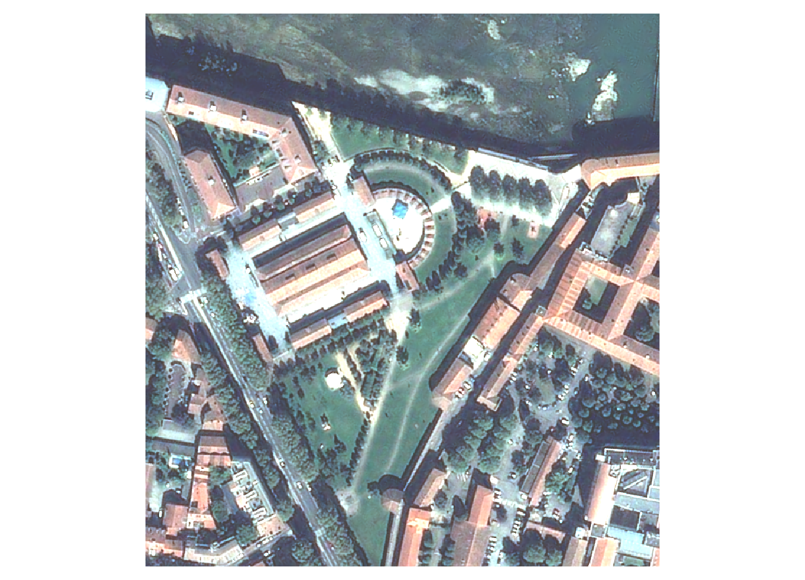
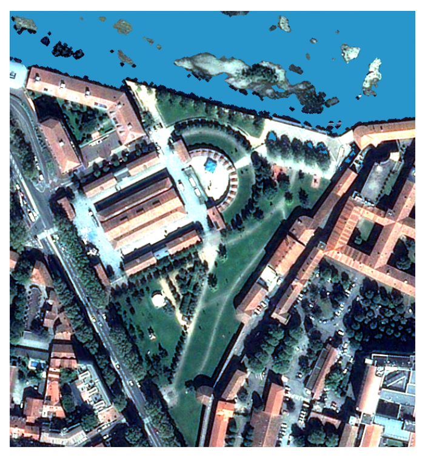
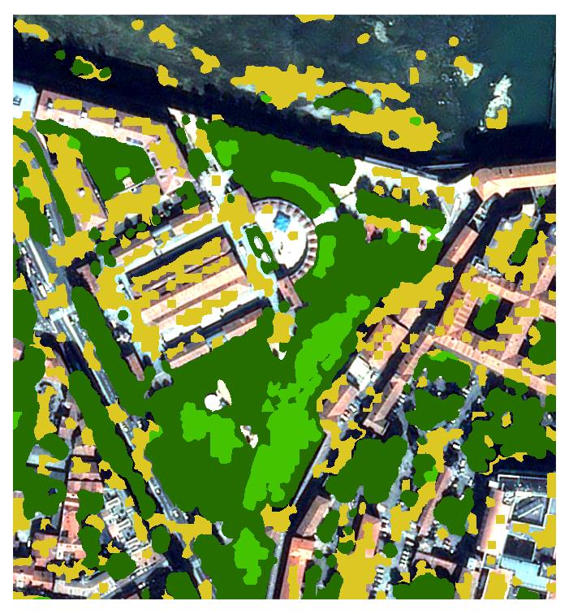
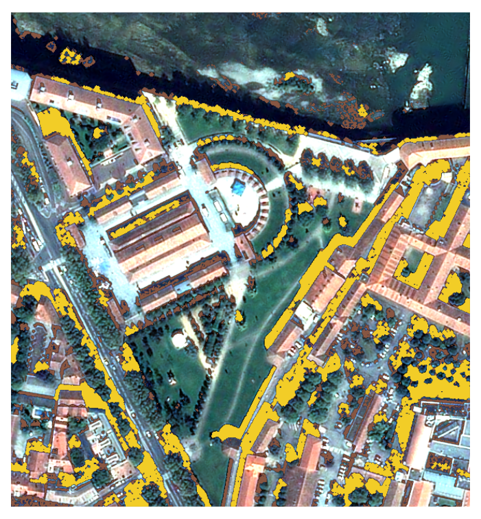
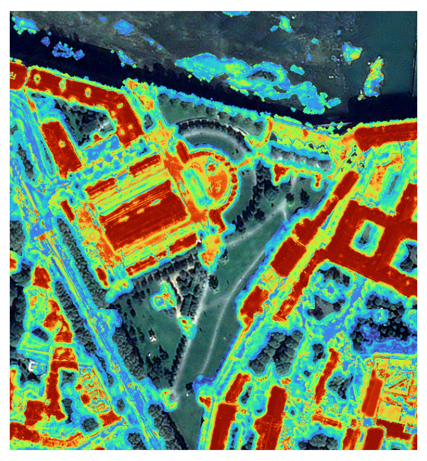
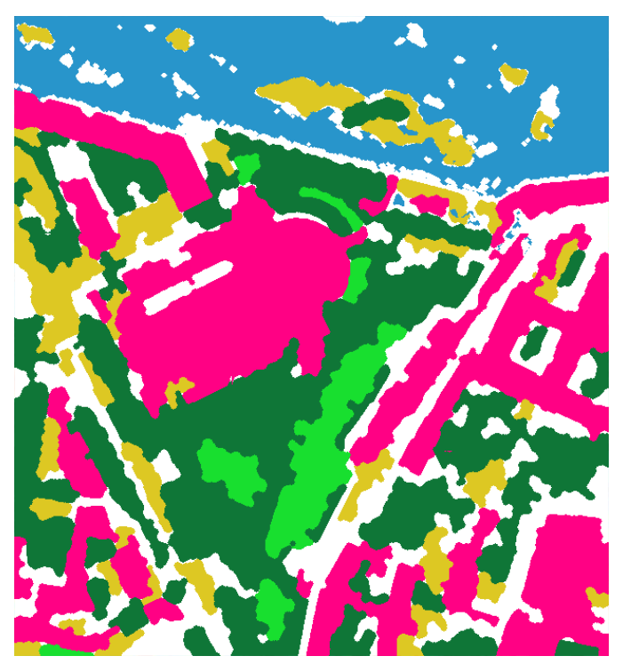

<div align="center">
  <a href="https://gitlab.cnes.fr/pluto/slurp"></a>

<h4>slurp</h4>

[](https://www.python.org/downloads/release/python-3100/)


<p>
  <a href="#overview">Overview</a> •
  <a href="#features">Features</a> •
  <a href="#install">Install</a> •
  <a href="#getting-started">Getting Started</a> •
  <a href="#documentation">Documentation</a> •
  <a href="#contribution">Contribution</a> •
  <a href="#references">References</a>
</p>
</div>

## Overview

**SLURP** : **S**mart **L**and **U**se **R**econstruction **P**ipeline

SLURP is your companion to compute a simple land-use/land-cover mask from Very High Resolution (VHR) optical images. It proposes different few or unsupervised learning algorithms that produce *one-versus-all* masks (water, vegetation, shadow, urban). Then a final algorithm stacks them all together and regularize them to obtain into a single multiclass mask.

SLURP uses some global data, such as Global Surface Water (Pekel) for water detection or World Settlement Footprint (WSF) for building detection. 

Data preparation can be achieved with [Orfeo ToolBox](https://www.orfeo-toolbox.org/) or other tools, in order to bring all necessary data in the same projection. You can either build your mask step by step, or use a batch script to launch and build the final mask automatically.
<table border="0">
<tr>
<td>

</td>
<td>

</td>
<td>

</td>
<td>

</td>
<td>

</td>
<td>

</td>
</tr>
<tr>
<td>Bring your own VHR 4 bands (R/G/B/NIR) image (Pleiades, WorldView, PNEO, CO3D,...)</td>
<td>Learn water occurrence (from 'Pekel') and predict water mask</td>
<td>Use an unsupervised clustering algorithm to detect low/high vegetation and bare ground</td>
<td>Detect large shadows (but avoid water confusion)</td>
<td>Learn 'WSF" urban mask and compute building probability</td>
<td>Stack and regularize building and vegetated areas contours</td>
</tr>
</table>

## First steps

### Installation
SLURP can be installed with pip : 
```
pip install slurp-masks
```
Once your environment is ready, you can prepare data with slurp_prepare and then compute SLURP masks with slurp_watermask, slurp_urbanmask, etc.

A tutorial is available : [Tutorial.md](https://github.com/CNES/slurp/blob/improve_doc/docs/source/Tutorial.md).

### Compute a land cover map
SLURP computes several single-class masks (one versus all) and then stacks (and regularize) them into a multi-class map.

SLURP needs to superimpose some external data so it fits your target VHR image. It can be done through OTB Superimpose application
```
mkdir out
# Superimpose Pekel, Hand and WSF with OTB
# 
# /!\ Adapt path depending on where your global Pekel database (resp. HAND, WSF) is located
otbcli_Superimpose -inr <your VHR image.tif> -inm <path to Global Surface Water Pekel occurrence file> -out "out/pekel.tif?&gdal:co:TILED=YES&gdal:co:COMPRESS=DEFLATE" uint8 -interpolator nn
otbcli_Superimpose -inr <your VHR image.tif> -inm <path to Heigh Above Nearest Drainage map>  -out "out/hand.tif?&gdal:co:TILED=YES&gdal:co:COMPRESS=DEFLATE" 
otbcli_Superimpose -inr <your VHR image.tif> -inm <path to World Settlement Footprint map> -out "out/wsf.tif?&gdal:co:TILED=YES&gdal:co:COMPRESS=DEFLATE" uint8 -interpolator nn

# Prepare
slurp_prepare your_slurp_conf.json -file_vhr <your VHR image.tif>

# Watermask
slurp_watermask out/effective_used_config.json

# Vegetationmask
slurp_vegetationmask out/effective_used_config.json

# Shadowmask
slurp_shadowmask out/effective_used_config.json

# Urbanmask (without post-processing)
slurp_urbanmask out/effective_used_config.json 

# Stack
slurp_stackmasks out/effective_used_config.json 
```

## Compute a land cover map

### Input data
SLURP is designed to compute a simple land cover map (water, low/high vegetation, bare groud, buildings) from a VHR (Very High Resolution) image with
4 bands (Red, Green, Blue, Near-Infrared). It had been validated with Pleiades and tested with WordView, CO3D, Pleiades NEO images. It shall also work with images with lower resolution (ex : SPOT 6/7).

SLURP is based on few or unsupervised algorithms (random forest, clustering, segmentation) that need some auxiliary data for training step. 

| Data | Step / usage | Comments | 
| ------ | ------ | ------ |
| [Pekel](https://global-surface-water.appspot.com/download) (Global Surface Water) | **Water mask prediction** : Water occurrence [0-100] during the last 30 years, used to learn a water prediction model (*MANDATORY*) | The global map is mandatory but you can also use some data by month | 
| [Hand MERIT](http://hydro.iis.u-tokyo.ac.jp/~yamadai/MERIT_Hydro/) |  **Water mask prediction** : Map of height above nearest drainage used to optimize choice of "non water" samples in the training step (*OPTIONAL*)  |  Free after registration (other kind of HAND maps exist) |
| [WSF 2019](https://download.geoservice.dlr.de/WSF2019/) (World Settlement Footprint) |   **Urban mask prediction** : global buildings map used to learn a building prediction model (*MANDATORY*)| Could be replaced by a better resolution map if available (ex : OSM buildings) |
| [ESA WorldCover](https://viewer.esa-worldcover.org/worldcover) | **Vegetation mask configuration** Global land cover map (10m resolution) used to customize vegetation clustering (*OPTIONAL*) | Very helpful to parameteriez balance between non-vegetation / low and high vegetation |

## Data preparation

Each mask needs some auxiliary files. They must be on the same projection, resolution and bounding box of the VHR input image to enable mask computation. You can generate this data yourself or use the prepare script available in SLURP.

The prepare script enables :
- Computation of stack validity (with or without a cloud mask)
- Computation of NDVI and NDWI
- Extraction of largest Pekel file
- Extraction of largest HAND file
- Extraction of WSF file
- Computation of texture file with a convolution


**To run the script**

1. Configure the JSON file. A template is available at conf/main_config.json with default values.
2. Update input, aux_layers, resources and prepare blocks inside the JSON file.
3. Run the command :
```
slurp_prepare <JSON file>
```

You can override the JSON with CLI arguments. For example : `slurp_prepare <JSON file> -file_vhr <VHR input image> -file_ndvi <path to store NDVI>`

Type `slurp_prepare -h` for complete list options :
- overwriting of output files (-w)
- bands identification (-red <1/3>, etc.), 
- files to extract and reproject (-pekel, -hand, -wsf, etc.), 
- output paths (-extracted_pekel, etc.),
- etc.
 
## Features

### Water mask
Water model is learned from Pekel (Global Surface Water) reference data and is based on NDVI/NDWI2 indices. 
Then the predicted mask is cleaned with Pekel, possibly with HAND (Height Above Nearest Drainage) maps and post-processed to clean artefacts.

**To compute the mask**

1. Configure the JSON file : a template is available at conf/main_config.json with default values.
2. Update input, aux_layers and masks blocs inside the JSON file. To go further you can modify resources, post_process and water blocs.
3. Run the command :
```
slurp_watermask <JSON file>
```

You can override the JSON with CLI arguments. For example : `slurp_watermask <JSON file> -file_vhr <VHR input image> -watermask <your watermask.tif>`

Type `slurp_watermask -h` for complete list of options :
- samples method (-samples_method, -nb_samples_water, etc.), 
- add other raster features (-layers layer1 [layer 2 ..]),
- post-process mask (-remove_small_holes, -binary_closing, etc.),
- saving of intermediate files (-save),
- etc.

### Vegetation mask
Vegetation mask are computed with an unsupervised clustering algorithm. First some primitives are computed from VHR image (NDVI, NDWI2, textures).
Then a segmentation is processed (SLIC) and segments are dispatched in several clusters depending on their features.
A final labellisation affects a class to each segment (ie : high NDVI and low texture denotes for low vegetation).

**To compute the mask**

1. Configure the JSON file : a template is available at conf/main_config.json with default values.
2. Update input, aux_layers and masks blocs inside the JSON file. To go further you can modify resources and vegetation blocs.
3. Run the command :
```
slurp_vegetationmask <JSON file>
```

You can override the JSON with CLI arguments. For example : `slurp_vegetationmask <JSON file> -file_vhr <VHR input image> -vegetationmask <your vegetation mask.tif>`

Type `slurp_vegetationmask -h` for complete list of options : 
- segmentation mode and parameter for SLIC algorithms
- number of workers (parallel processing for primitives and segmentation tasks)
- number of clusters affected to vegetation (3 by default - 33%)
- etc.


### Urban (building) mask
An urban model (building) is learned from WSF reference map. The algorithm can take into account water and vegetation masks in order to improve samples selection (non building pixels will be chosen outside WSF and outside water/vegetation masks). 
The output is a "building probability" layer ([0..100]) that can be used by the stack algorithm.

**To compute the mask**

1. Configure the JSON file : a template is available at conf/main_config.json with default values.
2. Update input, aux_layers and masks blocs inside the JSON file. To go further you can modify resources and urban blocs.
3. Run the command :
```
slurp_urbanmask <JSON file>
```

You can override the JSON with CLI arguments. For example : `slurp_urbanmask <JSON file> -file_vhr <VHR input image> -urbanmask <your urban mask.tif>`

Type `slurp_urbanmask -h` for complete list of options :
- samples parameters), 
- add other raster features (-layers layer1 [layer 2 ..])
- elimination of pixels identified as water or vegetation (-watermask <your watermask.tif>, -vegetationmask <your vegetationmask.tif>),
- etc.

### Shadow mask
Shadow mask detects dark areas (supposed shadows), based on two thresholds (RGB, NIR). 
A post-processing step removes small shadows, holes, etc. The resulting mask is a three-classes mask (no shadow, small shadow, big shadows). 
The big shadows can be used in the stack algorithm in the regularization step.

**To compute the mask**

1. Configure the JSON file : a template is available at conf/main_config.json with default values.
2. Update input, aux_layers and masks blocs inside the JSON file. To go further you can modify resources, post_process and shadow blocs.
3. Run the command :
```
slurp_shadowmask <JSON file>
```

You can override the JSON with CLI arguments. For example : `slurp_shadowmask <JSON file> -file_vhr <VHR input image> -shadowmask <your shadow mask.tif>`

Type `slurp_shadowmask -h` for complete list of options :
- relative thresholds (-th_rgb, -th_nir, etc.),
- post-process mask (-remove_small_objects, -binary_opening, etc.),
- etc.

### Stack and regularize buildings
The stack algorithm take into account all previous masks to produce a 6 classes mask (water, low vegetation, high vegetation, building, bare soil, other) and an auxilliary height layer (low / high / unknown). 
The algorithm can regularize urban mask with a watershed algorithm based on building probability and context of surrounding areas. This algorithm first computes a gradient on the image and fills a marker layer with known classes. Then a watershed step helps to adjust contours along gradient image, thus regularizing buildings shapes.

**To compute the mask**

1. Configure the JSON file : a template is available at conf/main_config.json with default values.
2. Update input, aux_layers and masks element inside the JSON file. To go further you can modify resources, post_process and stack blocs.
3. Run the command :
```
slurp_stackmasks <JSON file>
```

You can override the JSON with CLI arguments. For example : `slurp_stackmasks <JSON file> -file_vhr <VHR input image> -remove_small_objects 500 -binary_closing 3`

Type `slurp_stackmasks -h` for complete list of options :
- watershed parameters,
- post-process parameters (-remove_small_objects, -binary_opening, etc.),
- classif value of each element of the final mask
- etc.


## Tests

The project comes with a suite of unit and functional tests. All the tests are available in tests/ directory.

To run them, launch the command `pytest` in the root of the slurp project. To run tests on a specific mask, execute `pytest tests/<file_name>"`.

By default, the tests generate the masks and then validate them by comparing them with a reference. You can choose to only compute the masks with `pytest -m computation` or validate them with `pytest -m validation`. To validate data preparation, you can use `pytest -m prepare` or `pytest -m all` for the complete test : these two last modes require OTB installation.

You can change the default configuration for the tests by modifying the JSON file "tests/config\_tests". 


## Documentation

Documentation can be found on [read the docs](https://slurp-masks.readthedocs.io/en/latest/index.html)

## Contribution

See [Contribution](./CONTRIBUTING.md) manual

## References

This package was created with PLUTO-cookiecutter project template.


Inspired by [main cookiecutter template](https://github.com/audreyfeldroy/cookiecutter-pypackage) and 
[CARS cookiecutter template](https://gitlab.cnes.fr/cars/cars-cookiecutter)
