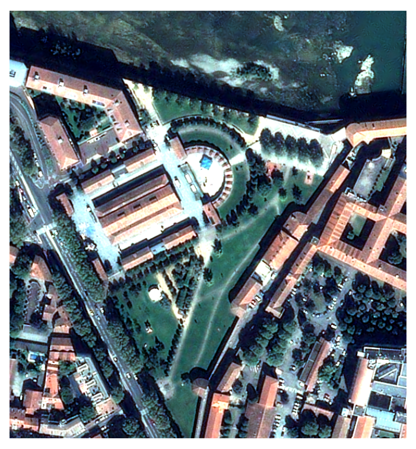

<div align="center">
  <a href="https://gitlab.cnes.fr/pluto/slum"></a>

<h4>slum</h4>

[](https://www.python.org/downloads/release/python-360/)


<p>
  <a href="#overview">Overview</a> •
  <a href="#features">Features</a> •
  <a href="#install">Install</a> •
  <a href="#documentation">Documentation</a> •
  <a href="#contribution">Contribution</a> •
  <a href="#references">References</a>
</p>
</div>

## Overview

**SLUM** : **S**imple **L**and **U**se **M**asks

SLUM proposes different algorithms to perform Land Use/Land Cover masks, with few data. Several algorithms perform binary mask (water, vegetation, building, etc.) and some methods are then applied to regularize and merge masks into a single multiclass mask.
<table border="0">
<tr>
<td>

</td>
<td>

</td>
<td>

</td>
<td>

</td>
</tr>
</table>

## Install
You need to clone the repository and pip install SLUM.
```
git clone git@gitlab.cnes.fr:pluto/slum.git
```
To install SLUM, you need OTB and some libraries already installed on VRE OT.
Otherwise, if you are are connected to HAL, or working on your personal computer (Linux), 
you may set the environment as mentioned below.
### Create a virtual env with all libraries (if you don't use VRE OT)
On HAL, connect to a computing node to create & compile the virtual environment (needed to compile rasterio at install time)
```
qsub -l select=1:ncpus=4 -l walltime=01:00:00 -I
```
Load OTB and create a virtual env with some Python libraries
```
module load otb/7.4-python3.8.4
# Creates a virtual env base on Python 3.8.4
python -m venv slum_env
. slum_env/bin/activate
# upgrade pip and install several libraries
pip install pip --upgrade
pip install scikit-image scikit-learn geopandas scikit-learn-intelex matplotlib cython
# install and compile rasterio with compatible GDAL 
pip install rasterio --no-binary :all:
```
### Pip install
Go to the directory where SLUM had been cloned and pip install it.
```
cd slum
pip install .
```
Your environment is ready, you can compute SLUM masks with slum_watermask, slum_urbanmask, etc.

## Features

### Water mask
Water model is learned from Peckel (Global Surface Water) reference data and is based on NDVI/NDWI2 indices. 
Then the predicted mask is cleaned with Peckel, possibly with HAND maps and post-processed to clean artefacts.
```
slum_watermask <VHR input image> <your watermask.tif>
```
Type `slum_watermask -h` for complete list of options :

- bands identification (-red <1/3>), 
- add other raster features (-layers layer1 [layer 2 ..]), 
- post-process mask (-remove_small_holes, -binary_closing, etc.), 
- etc.
### Vegetation mask

### Urban (building / roads) mask
An urban model (either building or road) is learned from OSM reference map (provided as raster covering same extent as input VHR image). Adding an other OSM ground truth improves model (by learning counter-example) and thus eliminates a lot of false positive detection.
The resulting mask is supposed to be stack with other masks (water, vegetation) to improve final rendering.
```
slum_urbanmask -building_mask <raster ground truth - OSM, ..> <VHR input image> <your urban mask>
```
Type `slum_urbanmask -h` for complete list of options :

- add road mask to improve roads/building separation (-road_mask <raster ground truth>)
- use RGB, add other features, etc.


### Shadow mask

### Stack all together

### Regularization step with Magiclip

## Documentation

Go in docs/ directory

## Contribution

See [Contribution](./CONTRIBUTING.md) manual

## References

This package was created with PLUTO-cookiecutter project template.


Inspired by [main cookiecutter template](https://github.com/audreyfeldroy/cookiecutter-pypackage) and 
[CARS cookiecutter template](https://gitlab.cnes.fr/cars/cars-cookiecutter)
