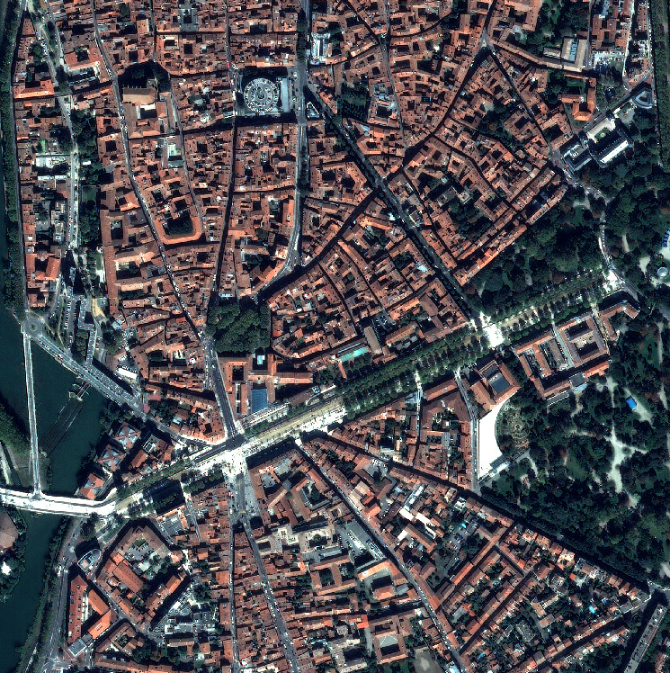

.. _graphcut:

Advanced use: improve multiclass mask regularization
====================================================

The stack mask employs a regularization method to more precisely and smoothly define the edges of objects in the scene (typically buildings). Two regularization approaches are implemented:

1. **Watershed with markers** - a heuristic that relies on image edges to delineate object borders together with segmentation seeds (called *markers*). These markers correspond to high-probability areas derived from the land-use masks computed by SLURP. This method is sensitive to noise, especially when the edges are not closed.

2. **GraphCut** - an approach that mitigates the weaknesses of the watershed by combining a unary term based on SLURP and the Morphological Building Index (MBI) with a pairwise regularization term that depends on the neighborhood of each pixel (also derived from image edges).  

This document presents an example of the two regularization approaches on an image extract from Toulouse (France).

   VHR image Toulouse

.. warning::

    Depending on which regularization you want to perform, you may need to install PyMaxflow on your system as an additional dependency.
    Please refer to the PyMaxflow tutorial provided `here <https://pmneila.github.io/PyMaxflow/tutorial.html>`_  for more details.

Parameters
----------

In addition to the JSON configuration file, SLURP requires some auxiliary parameters to compute the different masks generated from all the scenarios, including graphcut.

.. raw:: html

    

    <table class="horizontal-borders">
        <tr>
          <th>Parameter</th>
          <th>Meaning</th>
          <th>Values</th>
        </tr>
        <tr>
          <td> <strong>regul_method</strong></td>
          <td>Choose the type of regularization for the segmentation</td>
          <td>Watershed, GraphCut, None (Mathematical morphology only)</td>
        </tr>
        <tr>
          <td> <strong>regul_classes</strong></td>
          <td>Choose on which classes to apply the regularization method</td>
          <td>All, vegetation, building</td>
        </tr>
        <tr>
          <td> <strong>edges_method</strong></td>
          <td>Choose how to calculate the edges of the VHR image</td>
          <td>Sobel gradients, Di Zenzo tensors</td>
        </tr>
        <tr>
          <td> <strong>edges_image</strong></td>
          <td>Choose on which bands to calculate the edges</td>
          <td>RGB composition, NIR, NDVI, multi-band (for Di Zenzo)</td>
        </tr>
    </table>
      

Fill in the configuration file
------------------------------

A template for the configuration file is available `here <https://github.com/CNES/slurp/blob/main/conf/main_config.json>`_.
All parameters are explained in the `SLURP configuration <slurp_config.html>`_ page.

Regularization pipeline
-----------------------

Here are examples of command lines to perform both watershed and graphcut regularization.

.. code-block:: console

    # Superimpose Pekel, Hand and WSF with OTB
    # /!\ Adapt path depending on where your config file is located
    slurp_stackmasks -regul_method watershed -regul_classes building -edges_method sobel -edges_images RGB config.json -d -stackmask watershed_building_sobel_rgb.tif
    slurp_stackmasks -regul_method graphcut -regul_classes all -edges_method dizenzo -edges_images multiband config.json -d -stackmask graphcut_all_dizenzo.tif

Results and comparison
----------------------

The watershed algorithm is a heuristic method that can be unstable in the presence of noise. Because it relies on gradient information, typically obtained with a Sobel operator to delineate region boundaries, any small perturbations on the edges can make the segmentation process less spatially coherent, resulting in over segmentation and fragmented regions. Moreover, the watershed approach does not explicitly enforce global consistency; it treats each local minima independently, which can cause divergent results when the underlying gradient field is noisy or when the true object boundaries are weak. 
In contrast, graphcut segmentation mitigates these issues by formulating the problem as a global energy minimisation over a graph that encodes both data fidelity and spatial smoothness. The pairwise terms in a graphcut model explicitly capture neighbourhood relationships, allowing the algorithm to leverage spatial context to suppress isolated noisy edges and produce coherent, well-connected regions.

Results
-------

.. raw:: html

    <table border="0" style="margin: auto; text-align: center;">
      <tr>
        <td style="width:300px;">
          
        </td>
        <td style="width:300px;">
          
        </td>
      </tr>
      <tr>
        <td><b>Watershed Regularization</b></td>
        <td><b>Graphcut Regularization</b></td>
      </tr>
    </table>

